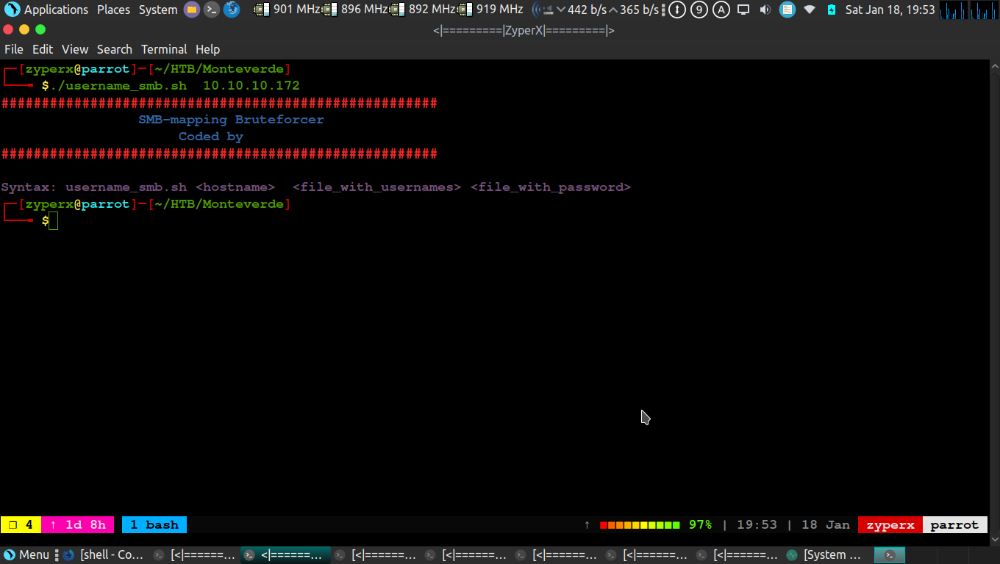

# <h1>SMB-MAP-BRUTE</h1>
+Mapping SMB service through Bruteforce.

+Found valid username and password

<h2>REQUIREMENTS</H2>
<H4>->SMBMAP</H4>

<H2>INSTALLATION</H2>
<H4>->chmod a+x smb_map_brute.sh</h4>

<H2>SYNTAX</H2>
<H4>->smb_map_brute.sh <host> <users.txt> <password.txt>

